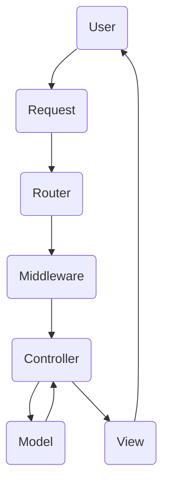

# Módulo 08

## PHP

### Aula 01
#### Tópicos abordados:
- Constantes e variáveis
- Operadores aritméticos
- Concatenação de strings
- Operadores lógicos
- Condicionais
- Laços de repetição
- Arrays
- Funções

### Aula 02
#### Tópicos abordados:
- Conceitos de Orientação a Objetos
- Model View Controller (MVC)
- Configurando o VHosts
- Criando o Template

- User: Interage e faz as entradas no sistema
- Request: Solicitações (URL e Demais entradas)
- Router: Encaminhador, responsável pelo roteamento, armazena qual controller será chamado para cada URL, vincula os Middlewares ao Controller
- Middlewares: é um verificador de autorizações, verifica requisitos e qualquer outra trava do sistema
- Controller: Interpreta a requisição, valida os dados, aciona os modelos e chamada as views
- Model: Representação de dados, lógica de negócios, gerenciamento de banco de dados, estado da aplicação
- View: interface do usuário, apresentação, representação visual e exibição de dados

### Aula 03
#### Tópicos abordados:
- Separando a View do Template
- Criando o Controller
- Criando o Router
- Tornando as Views Dinâmicas
- Adicionando Variáveis as Rotas
- Finalizando as Rotas

### Aula 04
#### Tópicos abordados:
- Gestor de configurações
- Criando a Conexão com a Base de Dados
- Criando o Core Model
- Criando o Insert
- Where e Load
- Update e Delete
- Refinando o Model
- Auditando Alterações